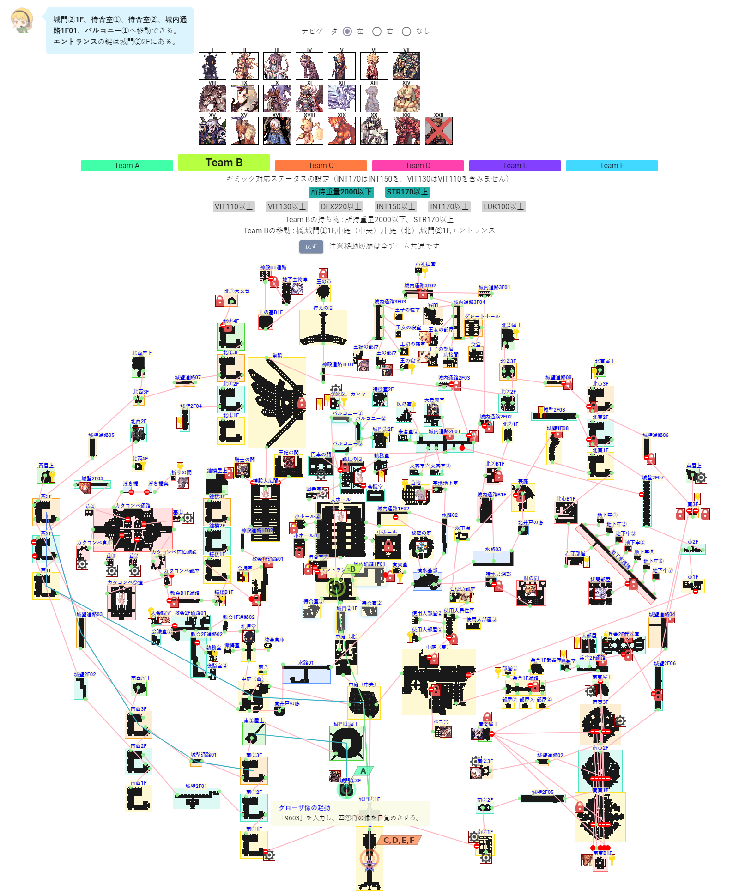

# refine-tiamat
<a href="https://yapparo.net" target="_blank" rel="noopener noreferrer">やっぱりROが好き！</a>内コンテンツ<a href="https://ragnarokonline.gungho.jp" target="_blank" rel="noopener noreferrer">jRO</a>版深淵の古城シミュレータ「<a href="https://yapparo.net/social/tiamat" target="_blank" rel="noopener noreferrer">古城の絆</a>」をリファクタリングしたいリポジトリ



## Build Setup

```bash
# install dependencies
$ yarn install

# serve with hot reload at localhost:3000
$ yarn dev

# build for production and launch server
$ yarn build
$ yarn start

# generate static project
$ yarn generate
```

For detailed explanation on how things work, check out [Nuxt.js docs](https://nuxtjs.org).

## Policy
本リポジトリは、[「ラグナロクオンライン」著作物利用ガイドライン](https://ragnarokonline.gungho.jp/support/play-manner/copyright.html)に基づき、「ファン活動」例の１つ「攻略サイトやデータサイトの作成、公開」を目的としています。
使用されている画像の一部は、ガンホー・オンライン・エンターテイメント株式会社および開発元である株式会社Gravityまたは両社に使用を許諾した権利者に帰属します。

©Gravity Co., Ltd. & LeeMyoungJin(studio DTDS) All rights reserved.
©GungHo Online Entertainment, Inc. All Rights Reserved.